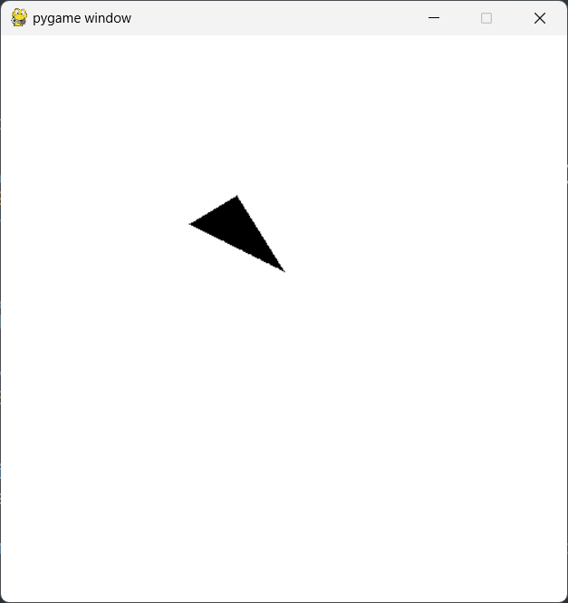

# Programming Assignment 4

Class: CS 4204, Fall 2024

Professor: Dr. Brendan David-John

## Overview

In this programming assignment, you are going to complete the fourth step towards building our renderer: a camera module. As discussed in class, our renderer is going to be composed of several independent modules. The camera module is responsible for implementing the data structure to perform camera view, normalization, and projection of world-space coordinates. Specifically, it will provide a class called `OrthoCamera` that contains a `Transform` for the camera orientation and orthographic projection variables. The `OrthoCamera` class will provide exposed methods that allow the renderer to transform world coordinates to camera coordinates and then project them into normalized device coordinates within the bounds of (-1,-1) to (1,1) and vice versa. Please read the entire document before starting the assignment.


## Instructions

For this assignment, you will create a python file called `camera.py`, and within that file there will be a class called `OrthoCamera`. `OrthoCamera` needs to be implemented as detailed below. 

Now that we are able to transform 3D meshes within world space, we need to be able to project them into a camera viewport for rendering. This will be accomplished by creating a `OrthoCamera` module that can apply transformations to world space vertices. This module will implement an orthographic camera projection.

Like the previous Assignments, this assignment will make use of numeric checks on known transforms to validate your solutions, as visual validation is not possible not possible until we have methods to shade objects in our sofware rasterizer renderer.

Tip: Implementing the transformation from world space to camera space can be accomplished using the `apply_inverse_to_point` function of the camera's transform.

Tip: Recall in our coordinate system that the camera looks down the negative Z axis, with positive Y pointing up. As a right-handed coordinate system, the positive X axis goes to the right relative to camera lookat direction.


### Output

The following should be the output when `assignment4.py` is run:

```bash
python assignment4.py
```


Note that `assignment4.py` requires that the `OrthoCamera` class has a `Transform` object member used to set the position and rotation of the camera.

The following should be the output when pytest with the verbose flag is run:

```bash
pytest -v assignment4.py
```


### Dependency Management
Each assignment will include a requirements.txt file that includes the python package requirements for the assignment. If you are using PyCharm it should automatically detect and install the dependencies when you create the virtual environment. Otherwise, [these instructions](https://www.jetbrains.com/help/pycharm/managing-dependencies.html#configure-requirements) will help you manually manage the requirements in PyCharm. If you are using something other than PyCharm, you can use the command line to manually install the packages from the requirements.txt file:

```bash
pip install -r requirements.txt
```

## The OrthoCamera Class

### Exposed Members

#### `transform`
A `Transform` object exposed to set the orientation (position and rotation) of the camera.

### Exposed Methods

#### `__init__(self)`
The constructor takes six floats as arguments: `left` ,  `right`,  `bottom`,  `top`,  `near`, and `far`. These arguments define the orthographic projection of the camera used to construct `ortho_transform`. The camera `transform` is initialized with the `Transform` default constructor.

#### `ratio(self)`
This method simply returns a float that is the ratio of the camera projection plane's width to height. That is, if the screen width is 6 in world space and the screen height is 3, then this method would return `2.0`.

#### `project_point(self, p)`
This method takes a 3 element Numpy array, `p`, that represents a 3D point in world space as input. It then transforms `p` to the camera coordinate system before performing an orthographic projection using `ortho_transform` and returns the resulting 3 element Numpy array.

#### `inverse_project_point(self, p)`
This method takes a 3 element Numpy array, `p`, that represents a 3D point in normalized device coordinates as input. It then transforms `p` to the camera coordinate system before transforming back to world space using `inverse_ortho_transform` and returns the resulting 3 element Numpy array.

## Extra Credit
Extra credit for this assignment will be to render a single triangle defined in world coordinates using your `Screen`, `Mesh`, `Transform`, and `Camera` modules. Doing the extra credit will allow you to get a jump on the Camera 2 assignment which will include a naive render loop for meshes. The inputs are defined in the `extracredit.py` which provides `TODO` stubs for you to implement: (1) the transformation from device coordinates after the camera projection to screen coordinates (pixels), and (2) a render loop over the screen pixels that checks whether each pixel is contained within the triangle or not using barycentric coordinates and sets the color to `obj_color` within the screen image_buffer if so. The effect is a silhouette render, in which the background has one color and the foreground object has another color (typically black) to represent the triangle surface. The expected output is shown below:



Tip: It may be beneficial to add a `device_to_screen(self,p)` function or similar to your Screen class to transform normalized device coordinates to screen (pixel) coordinates.

## Rubric
There are 10 points (11 with extra credit) for this assignment:
- *3 pts*: pytest test_project_point passed
- *3 pts*: pytest test_inverse_project_point passed
- *1 pts*: pytest test_ratio passed
- *3 pts*: Printed vertex values match expected output after assignment3.py (see above)
